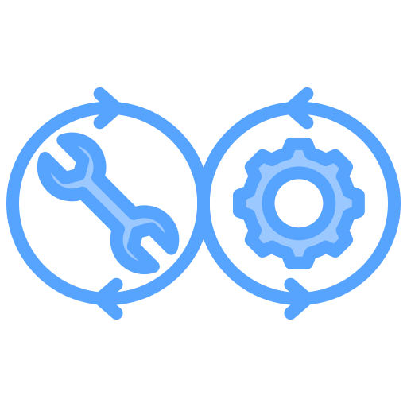

<h1 align="Center">Filosofía DevOps</h1>  

  

## Introducción 
*La filosofía DevOps se centra en la integración y colaboración entre los equipos de desarrollo y operaciones para mejorar la entrega de software.*  
*[Aquí](https://aws.amazon.com/es/devops/what-is-devops/) puedes encontrar más información de la mano de Amazon Web Services.*
 

## Principios clave

1. Colaboración
> Fomentar el trabajo conjunto entre desarrolladores y operadores.  
> Romper silos organizacionales para mejorar la comunicación.  
 

2. Automatización
> Automatizar procesos repetitivos, como pruebas y despliegues.  
> Reducir errores humanos y aumentar la eficiencia.  
 

3. Ciclo de Vida Ágil
> Adoptar metodologías ágiles para mejorar la adaptación a cambios.  
> Permitir lanzamientos más rápidos y frecuentes.
 

4. Monitoreo y Retroalimentación
> Implementar monitoreo continuo para identificar problemas rápidamente.  
> Utilizar métricas y feedback para mejorar procesos y productos.  
 
 
5. Cultura de Aprendizaje
> Fomentar un entorno donde los equipos aprendan de sus errores.  
> Promover la innovación y la adaptación constante.
 

## Conclusión
*En resumen, la filosofía DevOps busca crear una cultura de colaboración, eficiencia y mejora continua, donde los equipos trabajan juntos para entregar software de alta calidad de manera rápida y confiable.*

## Para moverse entre repositorios
  
  
 
